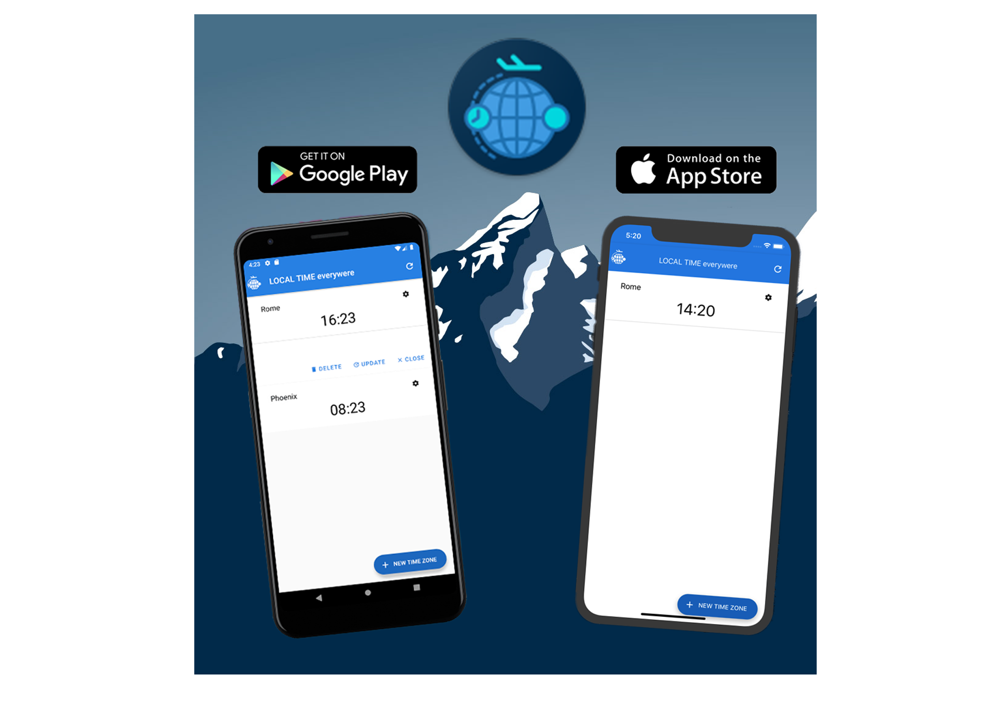

 

 MyLocalTimes

---
## _What is MyLocalTimes?_

MyLocalTimes is developed with [react-native](https://facebook.github.io/react-native/) and this is my first application with react-native, so this is my "Hello react native" application.

---
## What do it do?

This application helps to consult the timezone for all world, and it uses Moment.js library to obtain the correct timezone.

---
## Screenshot

  

## Where I can download the application?

You can find the application on [Google store](https://play.google.com/store/apps/details?id=com.mybetweentime&hl=en) and [App Store](https://apps.apple.com/us/app/mylocaltimes/id1499283018?l=it&ls=1), into future I can support also other marketplaces.

## Why you have developed this application?

I'm traveling to Phoenix (Arizona) for a few months and for applying my react-native lecture I decided to develop a mobile application for consulting the local time of cities, so I and my parents can use this application to know the time in each other city.

## I can improve this work with my contributing?

Yes, absolutely, I'm developing this application for learning react-native and improve my mobile develop skills, this project should be improved with the following addons:

- [ ] Introduce the patter MVC, in particular, the application component must be sub-divide in a "View" components, and a "Control" component;

- [X] Try to remove the API and work only with the library [Moment.js](https://momentjs.com/) or simile libraries;

- [X] Support different language, like:
    - [X] English
    - [X] Italian
    - [ ] Spanish
    - [ ] France

- [ ] Support the Web application.

## License

  

MyLocalTimes is an mobile app for consulting the local time of the cities.

Copyright (C) 2020-2021 Vincenzo Palazzo vincenzopalazzodev@gmail.com

This program is free software; you can redistribute it and/or modify it under the terms of the GNU General Public License as published by the Free Software Foundation; either version 2 of the License, or (at your option) any later version.

This program is distributed in the hope that it will be useful, but WITHOUT ANY WARRANTY; without even the implied warranty of MERCHANTABILITY or FITNESS FOR A PARTICULAR PURPOSE. See the GNU General Public License for more details.

You should have received a copy of the GNU General Public License along with this program; if not, write to the Free Software Foundation, Inc., 59 Temple Place, Suite 330, Boston, MA 02111-1307 USA
